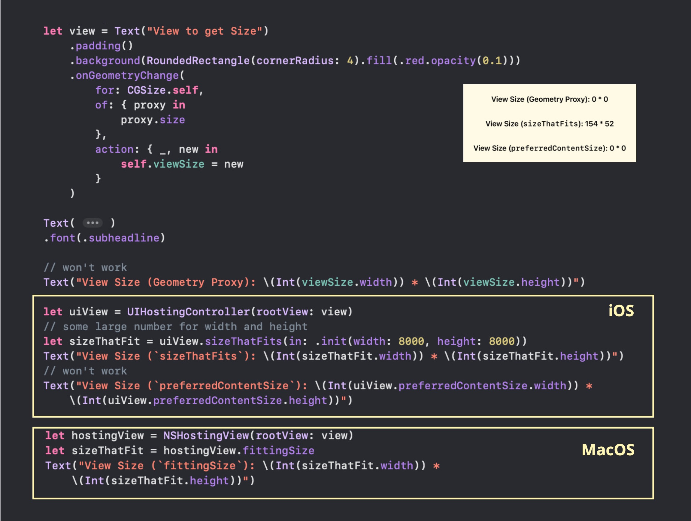

# SwiftUI_ViewSizeWithoutDisplayingView
A demo of Getting View Size without Displaying the View (iOS or MacOS)

For more details, please refer to my blog [Little SwiftUI Tip: Get View Size without Displaying the View](https://medium.com/p/346225197828).



## iOS
With UIHostingController + sizeThatFits(in:).

```swift
let uiView = UIHostingController(rootView: view)
// some large number for width and height
let sizeThatFit = uiView.sizeThatFits(in: .init(width: 8000, height: 8000))
Text("View Size (`sizeThatFits`): \(Int(sizeThatFit.width)) * \(Int(sizeThatFit.height))")
```

## MacOS
With NSHostingView + fittingSize


```swift
let hostingView = NSHostingView(rootView: view)
let sizeThatFit = hostingView.fittingSize
Text("View Size (`fittingSize`): \(Int(sizeThatFit.width)) * \(Int(sizeThatFit.height))")
```
